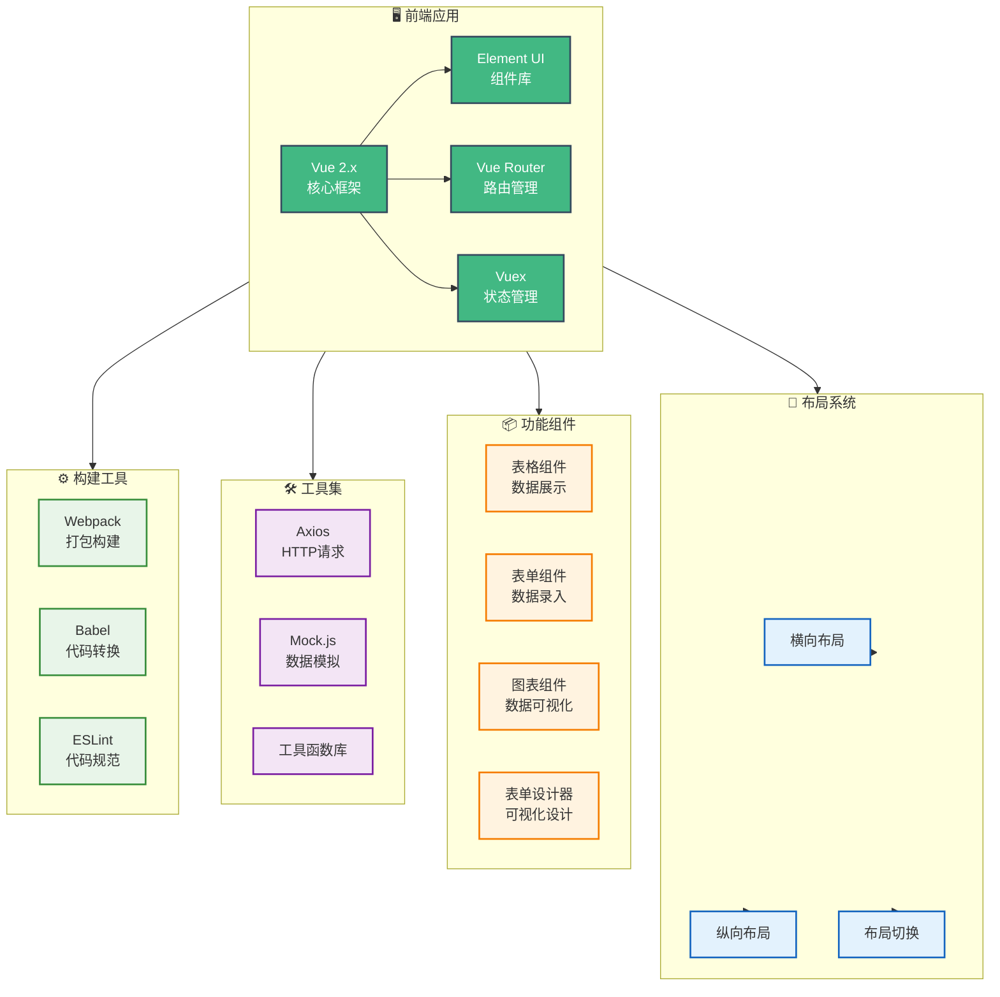

# 🎨 fork-vue-admin-beautiful - Vue后台管理系统


## 📖 项目简介

fork-vue-admin-beautiful是基于Vue2和Element UI的后台管理系统模板,提供横向/纵向布局切换、表单设计器、数据可视化等功能。

## 📦 项目来源

- **原项目**: [chuzhixin/vue-admin-beautiful](https://github.com/chuzhixin/vue-admin-beautiful)
- **原作者**: chuzhixin
- **开源协议**: 商业许可证(非开源)
- **Fork时间**: 2024年

## 🔧 二次开发内容

本项目为原项目的学习研究版本,主要用于:
- 学习Vue后台管理系统的架构设计
- 研究组件库的封装和复用
- 了解前端权限管理的实现方法

## ⚠️ 许可证说明

本项目原项目为商业项目,仅供学习参考,请勿用于商业用途。如需商业使用,请联系原作者获取授权。

## 📊 系统架构




#### - [演示地址 2： vue-admin-clever （常规后台管理布局）](http://beautiful.panm.cn/vue-admin-clever)

## 友情链接

#### - [uView 文档（超棒的移动跨端框架，文档详细，上手容易）](https://uviewui.com/)

#### - [uView 开源地址（uView UI，是 uni-app 生态优秀的 UI 框架，全面的组件和便捷的工具会让您信手拈来，如鱼得水）](https://github.com/YanxinNet/uView)

#### - [✨Element UI 表单设计及代码生成器（可视化表单设计器，一键生成 element 表单）](https://github.com/JakHuang/form-generator)

#### - [pl-table 完美解决 element 万级表格数据渲染卡顿问题](https://github.com/livelyPeng/pl-table)

## 安装

```bash

# 进入项目目录
cd vue-admin-beautiful
# 安装依赖，一定要cnpm i，不用看网上乱七八糟的答案，本项目始终基于最新的package版本，cnpm不会出现任何问题，至于怎么安装cnpm自行百度
cnpm i
# 本地开发 启动项目
cnpm run serve
```

## 详细文档加讨论群获取 972435319


## vue-admin-beautiful 前端讨论群-1 972435319（详细文档加群获取）

不管您加或者不加 您都可以享受到开源的代码 感谢您的支持 群里的任何问题我都会一一解答 感谢您的信任 群内提供 vue-admin-beautiful-template 基础版本 群内提供详细的基础文档 适合框架快速入门


## vue-admin-beautiful 前端讨论群-VIP 805808910

群内问题优先回答 群主每周在线授课 提供脚手架搭建在线指导 组件封装方法指导 NPM 发包开发组件指导（需付费 100，帮助你的同时也帮了群主，感谢信任）群内提供专属 VIP 文档 能快速掌握脚手架搭建 开发工具配置的技巧（其实 50%的重复工作都可以靠工具来完成） 如有需要加作者 QQ 1204505056（加作者的前提是您愿意尊重知识，为人谦逊，不糟蹋开原作者的善良，如果你习惯了白嫖，那我尊重不同的声音，如果你觉得贵，请忽略。。。）


## 捐赠


## 关于商用

保留开发者控制台打印的框架及作者信息即可免费商用，如需自定义为自己的版权信息，需联系 QQ1204505056 支付 299
